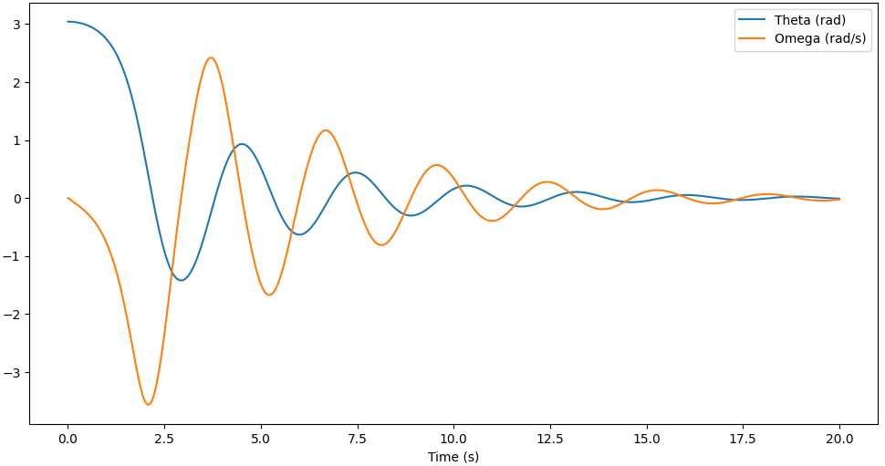
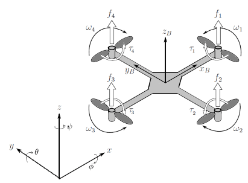
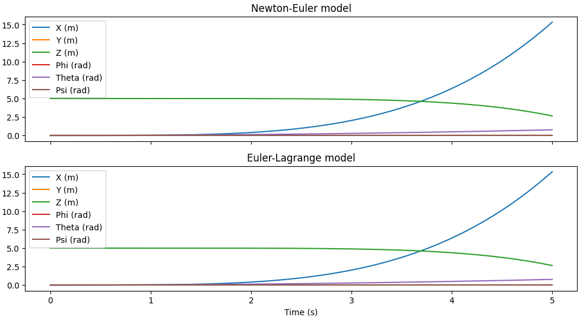
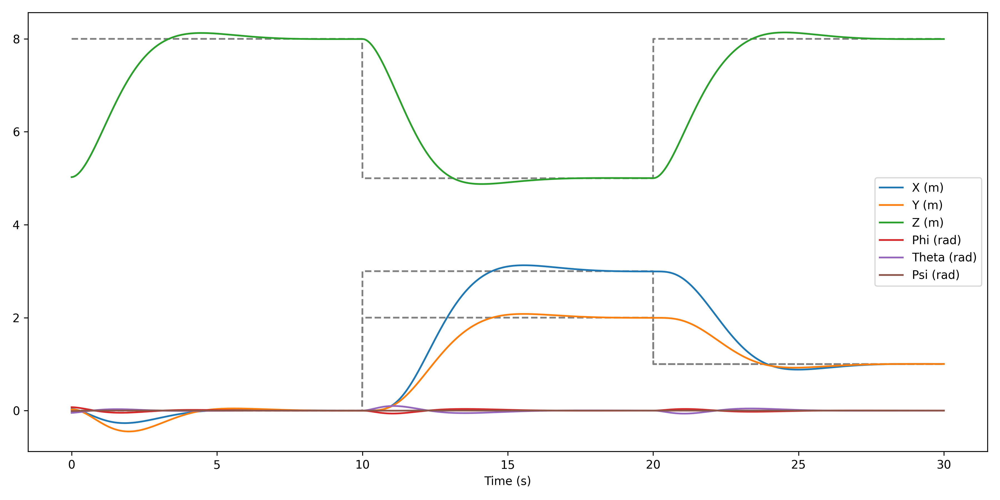
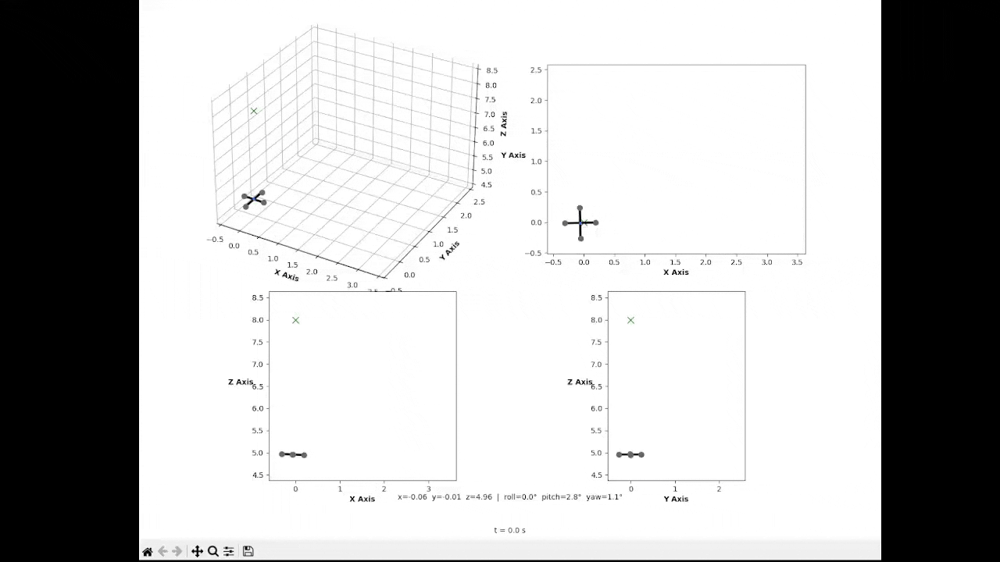

# benchmark-systems

Open collection of benchmark problems. The goal is to provide a common set of models to test and compare different control algorithms. These models have been used by the control community in many different implementations. 

The package is designed to be easy to use, using as few dependencies as possible. It is developed by [SUPPRESS Research Group](https://suppress.unileon.es/en/), from [Universidad de León](https://www.unileon.es/).

## Dependencies

The package has the following default dependencies:

- scipy >= 1.14.1
- solve-dae >= 0.2.3

Additionally, the `symbolic` module requires `casadi >= 3.7.2`, while the `animations` module requires `matplotlib >= 3.10.9`.

## How it works

Some models are implemented as functions that return a state-space representation of the system:

```python
def pendulum(t, x, *,
             m: float, L: float, drag: float = 0.0, u: float = 0.0) -> np.ndarray:
    '''
    Just a humble pendulum.
    '''

    g = Const.GRAVITY

    # State space
    dx = np.zeros(2)
    dx[0] = x[1]
    dx[1] = -g/L * sin(x[0]) - drag/(m*L**2)*x[1] + 1/(m*L**2)*u

    return dx

```
These models can be integrated using `solve_ivp` from `scipy`:

```python
pendulum_states = solve_ivp(lambda t, x: pendulum(t, x, m=1, L=2, drag=0.0, u=0),
                            t_span=(0, 20), y0=[np.pi-0.1, 0], t_eval=np.linspace(0, 20, 1000))

# --------------------------------- Plotting ---------------------------------
for i, label, in enumerate(['Theta (rad)', 'Omega (rad/s)']):
    plt.plot(pendulum_states.t, pendulum_states.y[i], label=label)
plt.xlabel('Time (s)')
plt.legend()
```


### Advanced models
Other models can be expressed more conveniently as a set of differential-algebraic equations (DAE). We select [`solve-dae`](https://github.com/SolveDAE/solve_dae/tree/main) to solve these models because it uses almost the same interface as `scipy`, and aims to be integrated into `scipy` in the future. 

For example, the model of a quadrotor can be expressed as a DAE or an ODE:



###### Image source: https://es.mathworks.com/help/symbolic/derive-quadrotor-dynamics-for-nonlinearMPC.html

* Newton-Euler model (ODE)
    States: $x = [x \ y \ z \ \phi \ \theta \ \psi \ s \ v \ w \ p \ q \ r]^T$; 

* Euler-Lagrange model (DAE)
    States: $x = [x \ y \ z \ \phi \ \theta \ \psi \ \dot{x} \ \dot{y} \ \dot{z} \ \dot{\phi} \ \dot{\theta} \ \dot{\psi} ]^T$;

Control actions: $u = [\omega_1^2 \ \omega_2^2 \ \omega_3^2 \ \omega_4^2 ]^T$

```python
quadrotor_params = {
    'Ixx': 1.2, 'Iyy': 1.2, 'Izz': 2.3, 'k': 1, 'L': 0.25, 'm': 2, 'drag': 0.2
}

w2 = quadrotor_params['m']*9.81/(quadrotor_params['k']*4) # Squared speed of the propellers in order to hover ... 4*k*w^2 = m*g

u = [w2*0.97, w2, w2*1.03, w2] # Pitch only

# --------------------------------- Simulation ---------------------------------
quadrotor_ode_states = solve_ivp(lambda t, x: quadrotor_ode(t, x, **quadrotor_params, u=u),
                                t_span=(0, 5), y0=[0,0,5] + 9*[0], t_eval=np.linspace(0, 5, 1000))
quadrotor_dae_states = solve_dae(lambda t, x, x_dot: quadrotor_dae(t, x, x_dot, **quadrotor_params, u=u),
                                t_span=(0, 5), y0=[0,0,5] + 9*[0], yp0=np.zeros(12), t_eval=np.linspace(0, 5, 1000))

# --------------------------------- Plotting ---------------------------------
fig, axs = plt.subplots(2, 1, sharex=True)
for i, label in enumerate(['X (m)', 'Y (m)', 'Z (m)', 'Phi (rad)', 'Theta (rad)', 'Psi (rad)']):
    axs[0].plot(quadrotor_ode_states.t, quadrotor_ode_states.y[i], label=label)
    axs[1].plot(quadrotor_dae_states.t, quadrotor_dae_states.y[i], label=label)
for i, model in enumerate(['Newton-Euler model', 'Euler-Lagrange model']):
    axs[i].legend()
    axs[i].set_title(model)
axs[-1].set_xlabel('Time (s)')
```



## Symbolic models
All the available models are also implemented in a symbolic way using `casadi`. The main advantage of this implementation comes when working with ODEs, where the symbolic model can be directly used to compute Jacobian matrices, in order to analyze dyncamis and design controllers. For example, instead of using the numerical quadrotor ODE, one can use its symbolic version:

```python
from benchmark_systems.symbolic import quadrotor_ode
quadrotor_params = {
    'Ixx': 1.2, 'Iyy': 1.2, 'Izz': 2.3, 'k': 1, 'L': 0.25, 'm': 2, 'drag': 0.2
}
quadrotor_params = {
    'Ixx': 1.2, 'Iyy': 1.2, 'Izz': 2.3, 'k': 1, 'L': 0.25, 'm': 2, 'drag': 0.2
}
w2 = quadrotor_params['m']*9.81/(quadrotor_params['k']*4) # Squared speed of the propellers in order to hover ... 4*k*w^2 = m*g
u = 4*[w2] # Hover

# --------------------------- Symbolic model --------------------------
quadrotor_fn = quadrotor_ode(**quadrotor_params)
```
Then, using `casadi` functionalities, one can compute the Jacobian matrices of the system, in order to obtain the following linearized model around the hover equilibrium point:
```math
\dot{x} = A x + B u
```

```python
jac_quadrotor = quadrotor_fn.jacobian()(t=0.0, x=[0, 0, 5] + 9*[0], u=u)
A = jac_quadrotor['jac_dx_x']
B = jac_quadrotor['jac_dx_u']
```
Selecting the first 6 states (xyz and roll-pitch-yaw) as the output of the system, we obtain an output matrix $C$ that renders the system observable:
```math
\begin{aligned}
\dot{x} &= A x + B u \\ y &= C x
\end{aligned}
```
```python
C = np.zeros((6, 12)) # Output matrix
C[:6, :6] = np.eye(6) # Position and angles are measured, but not velocities
```
And finally, we can construct the optimal $K$ matrix for a linear quadratic regulator (LQR) controller:
```math
\begin{aligned}
K &= \arg\min_K \int_0^\infty
\left( x^T C^T Q C x + u^T R u \right) \, dt \\
&\qquad \text{s. t.} \quad
\dot{x} = A x + B u, \quad u = -K x
\end{aligned}
```
```python
from control import lqr
# LQR weights
Q = np.diag([1, 1, 1, 100, 100, 100]) # Output cost matrix (we care more about angles than positions)
R = np.diag([1, 1, 1, 1]) # Control cost matrix

K, *_ = lqr(A, B, C.T @ Q @ C, R)
```
At this point, one can simulate the closed-loop system:

```math
\dot{x} = f(x, u_{eq} +\delta u) = f\big(x, u_{eq} - K (x - x_{ref})\big)
```

```python
import casadi as ca
x = ca.SX.sym('x', 12)
t = ca.SX.sym('t', 1)
u = ca.SX.sym('u', 3) # Now the input to the closed-loop system is the xyz reference to follow
x_ref = ca.vertcat(u, ca.DM.zeros(9)) # Reference state (we want to follow the position reference and keep all velocities and angles at 0)
u_eq = ca.vertcat(w2, w2, w2, w2) # Equilibrium input for the hover condition
du = -K @ (x - x_ref) # Control law for the LQR controller
cl_quadrotor_fn = ca.Function('cl_quadrotor', [t, x, u], [quadrotor_fn(t, x, u_eq + du)], ['t', 'x', 'u'], ['dx'])
```
And simulate the system:
```python
y0 = np.array([0, 0, 5] + 9*[0]) + 0.05*np.random.randn(12) # Initial state with small disturbances in all states
dt = 0.01 # seconds ... integration step for the simulation
t_ref = 10 # seconds ... time to hold each reference
refs = np.array([[0, 0, 8], [3, 2, 5], [1, 1, 8]]) # References to follow in the simulation

# ------------------------------------- Simulation ---------------------------------
# each reference is held for 10 seconds, taking 1000 samples in that interval
quadrotor_states = np.array([[] for _ in range(12)])
for ref in refs:
    states = solve_ivp_casadi(cl_quadrotor_fn, t_span=(0, t_ref), y0=y0 if quadrotor_states.size == 0 else quadrotor_states[:, -1],
                              N=int(t_ref/dt), u=ref)
    quadrotor_states = np.hstack([quadrotor_states, states.y])
t = np.linspace(0, 3*t_ref, quadrotor_states.shape[1])

# ------------------------------------- Plotting ---------------------------------
# Plot references
for i in range(3):
    plt.plot(t, np.repeat(refs[:, i], int(t_ref/dt)), '--', color='gray')
# Plot states
for i, label in enumerate(['X (m)', 'Y (m)', 'Z (m)', 'Phi (rad)', 'Theta (rad)', 'Psi (rad)']):
    plt.plot(t, quadrotor_states[i], label=label)
plt.legend()
plt.xlabel('Time (s)')
```


The function `solve_ivp_casadi` is implemented in a way that switching between the symbolic and numerical versions of the models is almost straightforward. For DAEs, the function `solve_dae_casadi` is also implemented.

Note that the closed-loop model does not need to be a symbolic one, given that we only want to simulate it. The following numerical function can be used to simulate the closed-loop system with `scipy`'s `solve_ivp`:
```python
from benchmark_systems.models import quadrotor_ode as numeric_quadrotor
from scipy.integrate import solve_ivp

u_eq = np.array([w2, w2, w2, w2]) # Equilibrium input for the hover condition

# ----------------------------- Numerical closed-loop model -------------------------
def cl_numeric_quadrotor(t, x, xyz_ref, **params):
    x = x.reshape(-1, 1) # Convert to column vector
    x_ref = np.hstack([xyz_ref, np.zeros(9)]).reshape(-1, 1) # Convert to column vector
    du = -K @ (x - x_ref)
    return numeric_quadrotor(t, x.flatten(), u=u_eq + du.flatten(), **params)

# -------------------------------------- Simulation ---------------------------------
quadrotor_states = np.array([[] for _ in range(12)])
for ref in refs:
    states = solve_ivp(lambda t, x: cl_numeric_quadrotor(t, x, ref, **quadrotor_params),
                          y0=y0 if quadrotor_states.size == 0 else quadrotor_states[:, -1],
                          t_span=(0, t_ref), t_eval=np.linspace(0, t_ref, int(t_ref/dt)), rtol=1e-6)
    quadrotor_states = np.hstack([quadrotor_states, states.y])
```
## Animations
The package also provides a simple way to animate the simulations. For example, the quadrotor simulation can be animated as follows:

```python
# 4 subplots
axis_3d = fig.add_subplot(221, projection='3d')
axis_3d.set_position([0.0, 0.45, 0.55, 0.55])  # [left, bottom, width, height]
axis_xy = fig.add_subplot(222)  # top-down X-Y
axis_xz = fig.add_subplot(223)  # X-Z plane
axis_yz = fig.add_subplot(224)  # Y-Z plane

# Remove intenisty of grid lines in the 3D plot
axis_3d.xaxis.pane.fill = False
axis_3d.yaxis.pane.fill = False
axis_3d.zaxis.pane.fill = False

axis_3d.grid(True, color='gray', alpha=0.2, linewidth=0.5)

# Axis labels
axis_3d.set_xlabel('X Axis', fontweight='bold'); axis_3d.set_ylabel('Y Axis', fontweight='bold'); axis_3d.set_zlabel('Z Axis', fontweight='bold')
axis_xy.set_xlabel('X Axis', fontweight='bold'); axis_xy.set_ylabel('Y Axis', fontweight='bold', rotation=0, labelpad=15)
axis_xz.set_xlabel('X Axis', fontweight='bold'); axis_xz.set_ylabel('Z Axis', fontweight='bold', rotation=0, labelpad=15)
axis_yz.set_xlabel('Y Axis', fontweight='bold'); axis_yz.set_ylabel('Z Axis', fontweight='bold', rotation=0, labelpad=15)

# If crashes (z<0), stop the animation. If not, animate until the end of the simulation.
crash_point = np.where(quadrotor_states[2, :] < 0)[0][0] if np.any(quadrotor_states[2, :] < 0) else None
if crash_point:
    x_lims = (min(quadrotor_states[0, :crash_point+10]) - 1, max(quadrotor_states[0, :crash_point+10]) + 1)
    y_lims = (min(quadrotor_states[1, :crash_point+10]) - 1, max(quadrotor_states[1, :crash_point+10]) + 1)
    t_anim = quadrotor_states[crash_point+10]
    axis_xz.hlines(0, *x_lims, color='red', linestyle='--', linewidth=1)
    axis_yz.hlines(0, *y_lims, color='red', linestyle='--', linewidth=1)
else:
    t_anim = quadrotor_states.shape[1] * dt

anim, _ = AutoAnimation(fig, Quadrotor(fig, axis_3d, axis_xy, axis_xz, axis_yz, L=quadrotor_params['L'],
                                       xyz=quadrotor_states[0:3, :int(t_anim/dt)], angles=quadrotor_states[6:9, :int(t_anim/dt)],
                                       xyz_ref=np.repeat(refs.T, int(t_ref/dt), axis=1)[:, :int(t_anim/dt)]),
                    duration=t_anim, dt=dt, speed=10, repeat=True)
```


In essence, the `AutoAnimation` function receives a figure and a callable, which is responsible for drawing the system in the figure at each time step. In this case, the `Quadrotor` class is responsible for drawing the quadrotor in the figure, given its states and the reference trajectory. The animation can be customized with different parameters, such as the duration of the animation, the time step between frames, the speed of the animation, and whether it should repeat or not.

# Examples
In the `examples` folder, you can find some Jupyter notebooks that show how to use the package to simulate and animate different systems.

# Installation
Currently, a prerelease version is available via TestPypi:

```bash
pip install -i https://test.pypi.org/simple/ benchmark-systems
```

This command will install the basic version of the package, which includes the numerical models. If you want to use the symbolic models, you need to install the package with the `sym` extra:

```bash
pip install -i https://test.pypi.org/simple/ benchmark-systems[sym]
```

If you want to use the animations, you need to install the package with the `anim` extra:

```bash
pip install -i https://test.pypi.org/simple/ benchmark-systems[anim]
```

Or you can install the package with all extras:

```bash
pip install -i https://test.pypi.org/simple/ benchmark-systems[all]
```
