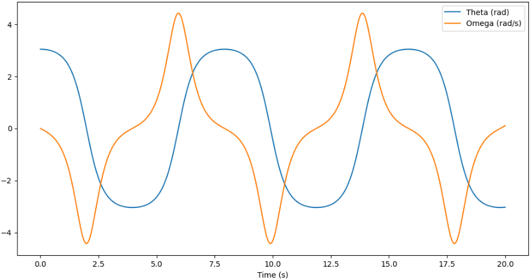

# benchmark-systems

Open collection of benchmark problems. The goal is to provide a common set of models to test and compare different control algorithms. These models have been used by the control community in many different implementations. 

The package is designed to be easy to use, using as few dependencies as possible. It is developed by [SUPPRESS Research Group](https://suppress.unileon.es/en/), from [Universidad de León](https://www.unileon.es/).

## Dependencies

The package has the following dependencies:

- scipy >= 1.14.1
- scipy-dae >= 0.0.6

## How it works

Some models are implemented as functions that return a state-space representation of the system:

```python
def pendulum(t, x, *,
             m: float, L: float, drag: float = 0.0, u: float = 0.0) -> np.ndarray:
    '''
    Just a humble pendulum.
    '''

    g = Const.GRAVITY

    # State space
    dx = np.zeros(2)
    dx[0] = x[1]
    dx[1] = -g/L * sin(x[0]) - drag/m*x[1] + 1/(m*L**2)*u

    return dx

```
These models can be integrated using `solve_ivp` from `scipy`:

```python
pendulum_states = solve_ivp(lambda t, x: pendulum(t, x, m=1, L=2, drag=0.5, u=0),
                            t_span=(0, 20), y0=[np.pi-0.1, 0], t_eval=np.linspace(0, 20, 1000))

for i, label, in enumerate(['Theta (rad)', 'Omega (rad/s)']):
    plt.plot(pendulum_states.t, pendulum_states.y[i], label=label)
plt.xlabel('Time (s)')
plt.legend()
```


### Advanced models
Other models can be expressed more conveniently as a set of differential-algebraic equations (DAE). We select [`scipy-dae`](https://github.com/JonasBreuling/scipy_dae/tree/main) to solve these models because it uses almost the same interface as `scipy`, and aims to be integrated into `scipy` in the future. 

For example, the model of a quadrotor can be expressed as a DAE or an ODE:


###### Image source: https://es.mathworks.com/help/symbolic/derive-quadrotor-dynamics-for-nonlinearMPC.html

* Newton-Euler model (ODE)
    States: $x = \begin{bmatrix} x \ y \ z \ \phi \ \theta \ \psi \ s \ v \ w \ p \ q \ r \end{bmatrix}^T$; 

* Euler-Lagrange model (DAE)
    States: $x = \begin{bmatrix} x \ y \ z \ \phi \ \theta \ \psi \ \dot{x} \ \dot{y} \ \dot{z} \ \dot{\phi} \ \dot{\theta} \ \dot{\psi} \end{bmatrix}^T$;

Control actions: $u = \begin{bmatrix} \omega_1^2 \ \omega_2^2 \ \omega_3^2 \ \omega_4^2 \end{bmatrix}^T$

```python
quadrotor_params = {
    'Ixx': 1.2, 'Iyy': 1.2, 'Izz': 2.3, 'k': 1, 'L': 0.25, 'm': 2, 'drag': 0.2
}

w2 = quadrotor_params['m']*9.81/(quadrotor_params['k']*4) # Squared speed of the propellers in order to hover ... 4*k*w^2 = m*g

u = [w2*0.97, w2, w2*1.03, w2] # Pitch only

quadrotor_ode_states = solve_ivp(lambda t, x: quadrotor_ode(t, x, **quadrotor_params, u=u),
                                t_span=(0, 5), y0=[0,0,5] + 9*[0], t_eval=np.linspace(0, 5, 1000))
quadrotor_dae_states = solve_dae(lambda t, x, x_dot: quadrotor_dae(t, x, x_dot, **quadrotor_params, u=u),
                                t_span=(0, 5), y0=[0,0,5] + 9*[0], y_dot0=np.zeros(12), t_eval=np.linspace(0, 5, 1000))

fig, axs = plt.subplots(2, 1, sharex=True)
for i, label in enumerate(['X (m)', 'Y (m)', 'Z (m)', 'Phi (rad)', 'Theta (rad)', 'Psi (rad)']):
    axs[0].plot(quadrotor_ode_states.t, quadrotor_ode_states.y[i], label=label)
    axs[1].plot(quadrotor_dae_states.t, quadrotor_dae_states.y[i], label=label)
for i, model in enumerate(['Newton-Euler model', 'Euler-Lagrange model']):
    axs[i].legend()
    axs[i].set_title(model)
axs[-1].set_xlabel('Time (s)')
```


## Models
All model simulations are available in the `examples` folder as a Jupyter notebook.